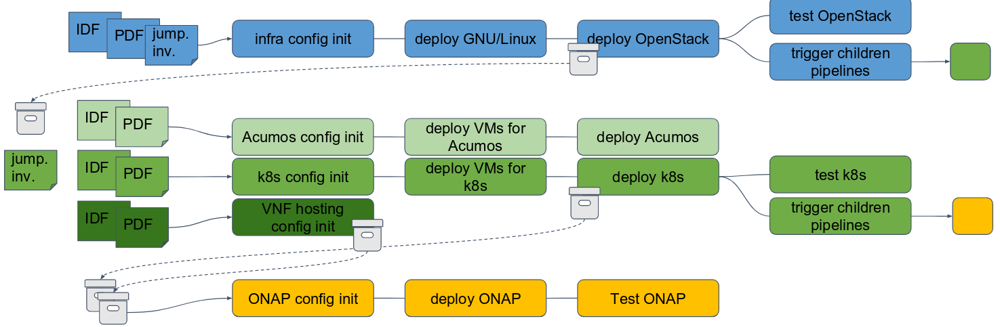

# From Infra to E2E testing

[Cédric Ollivier](mailto:cedric.ollivier@orange.com)

2019/04/04

## Infrastructure verification

### Functest in a nutshell

- verify any kind of OpenStack and Kubernetes deployments (OPNFV model)
  including production environments
- conform with upstream rules (OpenStack gate jobs and Kubernetes conformance
  tests)
- ensure that the platforms meet Network Functions Virtualization requirements

### Functest suites

- all functional tests as defined by the upstream communities (e.g. Tempest,
  neutron-tempest-api, Barbican, Patrole...)
- upstream API and dataplane benchmarking tools (Rally, Vmtp and Shaker)
- Virtual Network Function deployments and testing (vIMS, vRouter and vEPC)

### Xtesting in a nutshell

- allow the developer to work only on the test suites without diving into
  CI/CD integration
- simplify test integration in a complete LFN-based CI/CD toolchain (e.g.
  Jenkins, Testing Containers, Test API and dashboard)
- allow a proper design and verify multiple components in the same CI/CD
  toolchain (OpenStack, Kubernetes, ONAP, etc.)

**Easy to use and very useful for any CI/CD toochain**

### Chained CI

<!-- .element: style="border: 0" -->

## End2end network services testing

### Network automation journey

- test network equipment and software including the Data-Center infrastructure
- improve method and validation process to shorten the TTM
- need tools and methodology to quickly disseminate CI/CD culture and assemble
  sparsed testcases verifying network services

**Why not leveraging on existing opensource tools such as Xtesting?**

### Deploy your own testing toolchain

- deploy anywhere the full OPNFV CI/CD toolchain in a few commands
- could be instantiated for testing services out of the infrastructure domain
- offer all Xtesting-based fonctional jobs (e.g. Functest) to the endusers

### Testing [FTTH](https://en.wikipedia.org/wiki/Fiber_to_the_x) equipment

<!-- .element: style="border: 0; width: 90%" -->

### Demo

- describe the testcase execution
- build and publish your container
- list your test in the toolchain description
- deploy your own toolchain in a few commands

https://wiki.opnfv.org/pages/viewpage.action?pageId=32015004

## Conclusion

### Conclusion

- Xtesting is a key helper from first tests to full end2end service testing
- And we are still pushing the limits:
  - allow verifying production Infrastructure and then break the classical
    preproduction/production model
  - support Raspberry Pi

**Upstream first! Try it, and you will love it! **

## Thank you
